<div class="abs-tr m-6 flex gap-2">
  
</div>

# VS Code and WSL Workshop​


Presentation slides for developwers

<div class="pt-12">
  <span @click="$slidev.nav.next" class="px-2 py-1 rounded cursor-pointer" hover="bg-white bg-opacity-10">
    Press Space for next page <carbon:arrow-right class="inline"/>
  </span>
</div>

<div class="abs-br m-6 flex gap-2">
  <button @click="$slidev.nav.openInEditor()" title="Open in Editor" class="text-xl slidev-icon-btn opacity-50 !border-none !hover:text-white">
    <carbon:edit />
  </button>
  <a href="https://github.com/slidevjs/slidev" target="_blank" alt="GitHub"
    class="text-xl slidev-icon-btn opacity-50 !border-none !hover:text-white">
    <carbon-logo-github />
  </a>
</div>

<!--
The last comment block of each slide will be treated as slide notes. It will be visible and editable in Presenter Mode along with the slide. [Read more in the docs](https://sli.dev/guide/syntax.html#notes)
-->

---
transition: fade-out
---

# Who Are We?


<div>

  ## Dante Masciotra
  
  <br>
  <br>
  <div class="text-left">

  - 📝 4th Year Student
  - 🎨 Runs a Cooking Instagram Page [@dante.al.dente](https://www.instagram.com/dante.al.dente/) 
  - 🧑‍💻 Winner of Hack The North 2022

  </div>
</div>


<div class="text-right">

  ## Borhan Salfo
  
  <br>
  <br>
 <div dir="rtl">

  - 📝 FACTS ABOUT ME
  - 🎨 FACTS ABOUT ME
  - 🧑‍💻 FACTS ABOUT ME

</div>
</div>


<!--
You can have `style` tag in markdown to override the style for the current page.
Learn more: https://sli.dev/guide/syntax#embedded-styles
-->

<style>
h1 {
  background-color: #2B90B6;
  background-image: linear-gradient(45deg, #4EC5D4 10%, #146b8c 20%);
  background-size: 100%;
  -webkit-background-clip: text;
  -moz-background-clip: text;
  -webkit-text-fill-color: transparent;
  -moz-text-fill-color: transparent;
}
</style>

<!--
Here is another comment.
-->

---
layout: default
---

# Table of contents

<Toc maxDepth="2"></Toc>

---
transition: slide-up
class: text-center
---

# Visual Studio Code

 ## Visual Studio Code is a code editor made by Microsoft for Windows, Linux and macOS. It offers support for tons of programming languages and highly customizable.​

 <br>
 
 <br>

  ## Lets take a look at what we can do
---
layout: default
level: 2
---

# File Explorer
  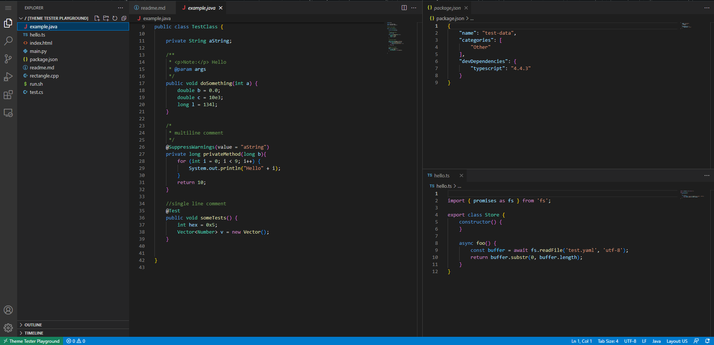
  <arrow v-click="[1, 2]" x1="200" y1="125" x2="80" y2="125" color="#ff0000" width="5" arrowSize="4" />


---
level: 2
---

# Extensions
  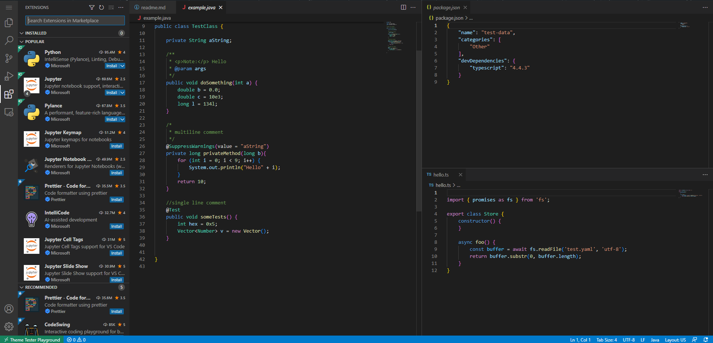

  <arrow v-click="[1, 2]" x1="200" y1="210" x2="80" y2="210" color="#ff0000" width="5" arrowSize="4" />

---
level: 3
---

# Our Favorite Extensions

VSC has large library of extensions check them out in extensions tab or at **https://marketplace.visualstudio.com/vscode**.

Here are some of our favorites

<div class="text-center" grid="~ cols-2 gap-2" m="-t-2">

<h2>Borhan</h2>

<h2>Dante</h2>

1

Code Runner

2

Git Graph

3

GitLens

</div>


---
level: 2
---

# Remote Explorer
  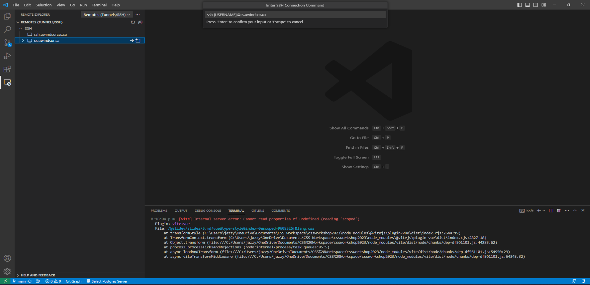

  <arrow v-click="[1, 2]" x1="200" y1="217" x2="80" y2="217" color="#ff0000" width="5" arrowSize="4" />
  <arrow v-click="[2, 3]" x1="270" y1="155" x2="155" y2="155" color="#ff0000" width="5" arrowSize="4" />
  <arrow v-click="[3, 4]" x1="600" y1="117" x2="460" y2="117" color="#ff0000" width="5" arrowSize="4" />

---
level: 3
---

# Remote Explorer Path

<div class="text-center">

```bash
ssh [Username]@cs.uwindsor.ca
```
</div>

---
class: px-20
level: 2
---

# Themes

  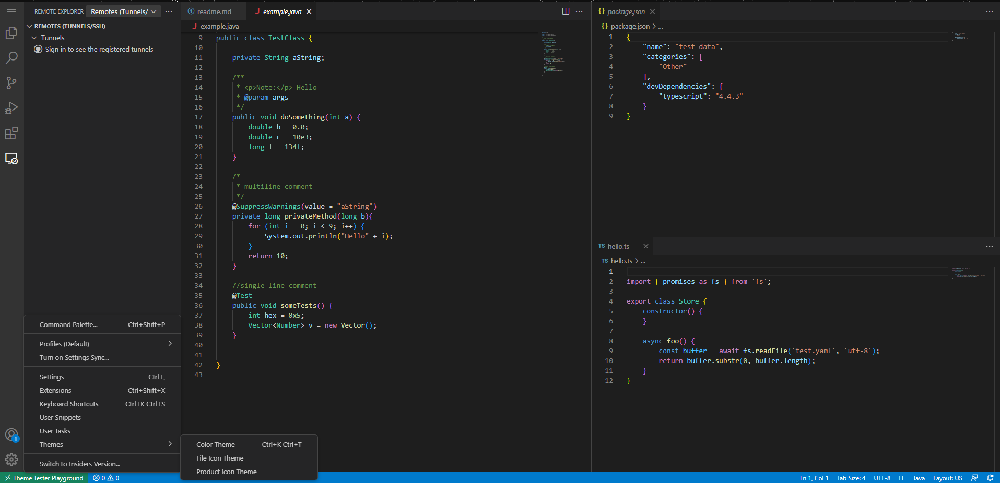

  <arrow v-click="[1, 2]" x1="90" y1="350" x2="90" y2="460" color="#ff0000" width="5" arrowSize="4" />
  <arrow v-click="[2, 3]" x1="270" y1="463" x2="140" y2="463" color="#ff0000" width="5" arrowSize="4" />
  <arrow v-click="[3, 4]" x1="430" y1="462" x2="333" y2="462" color="#ff0000" width="5" arrowSize="4" />

---
level: 3
---

# Themes

VSC comes with many themes but even more can be found at **https://vscodethemes.com/**.

Here are some of our favorites

<div grid="~ cols-2 gap-2" m="-t-2">

Borhan - Your Favorite

Dante - [Noctics Obescuro](https://vscodethemes.com/e/liviuschera.noctis/noctis-obscuro?language=javascript)

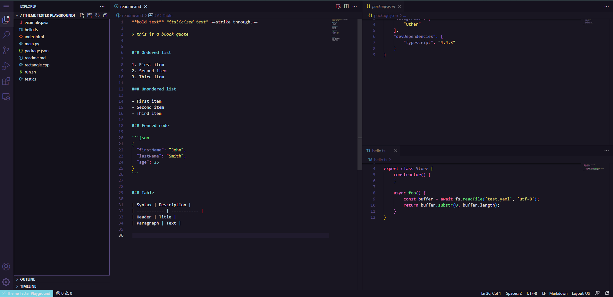

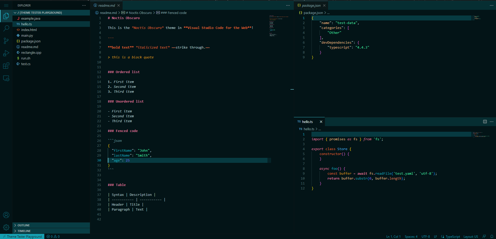

</div>

Look at themes available and pick your favorite but . . . 
<h2 v-click="[1, 2]">FLASH WARNING!!!</h2>

---
level: 3
---

# If You Like This One Then . . . 

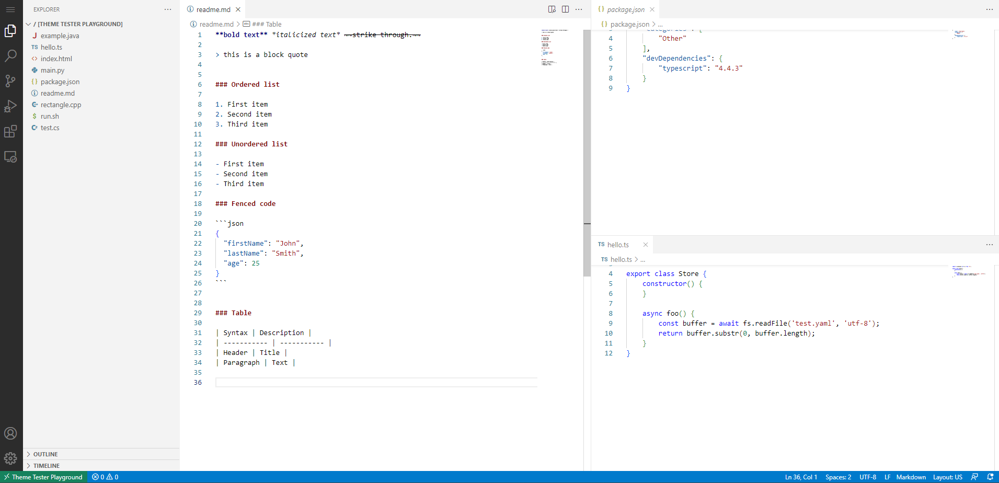


---
transition: slide-up
class: text-center
---

# Windows Subsystem for Linux (WSL)

 ## WSL is a feature of Windows that allows you to run a Linux environment without the need for a separate virtual machine or dual booting

 <br>
 
 <br>

  ## Lets take a look at what we can do
---
layout: default
level: 2
class: text-center 
---
# Install
### To install WSL run the below command in PowerShell. This will install the default Distro which is the latest version of Ubuntu
<br>

  ```bash
  wsl --intsall
  ```
<br>
<br>

### To look for available Distros 
<br>

  ```bash
  wsl --list --online
  ```
<br>
<br>

### Then to install a desired distro
<br>

 ```bash
 wsl --install -d DISTRO-NAME
  ```

---
layout: default
level: 2
class: text-center 
---

# Config

### If you want to run mutiple Distros than here are some helpful commands to config WSL to your prefences

<br>
To set default Distro

  ```bash
  wsl --set-default Distribution-Name
  ```

<br>

### If forget your password you'll need to run the following commands

  ```bash
  wsl -u root
  passwd username
  ```
---
layout: default
level: 2
class: text-center 
---

# Run

<br>
To run a WSL in a desired folder open your desired path in CMD or Powershell
<br>

  ```bash
  C:\your\path> wsl
  ```
<br>
To run a Distro that is not default
<br>

  ```bash
  C:\your\path> wsl --distribution Distribution Name 
  ```
<br>

---

# Diagrams

You can create diagrams / graphs from textual descriptions, directly in your Markdown.

<div class="grid grid-cols-4 gap-5 pt-4 -mb-6">

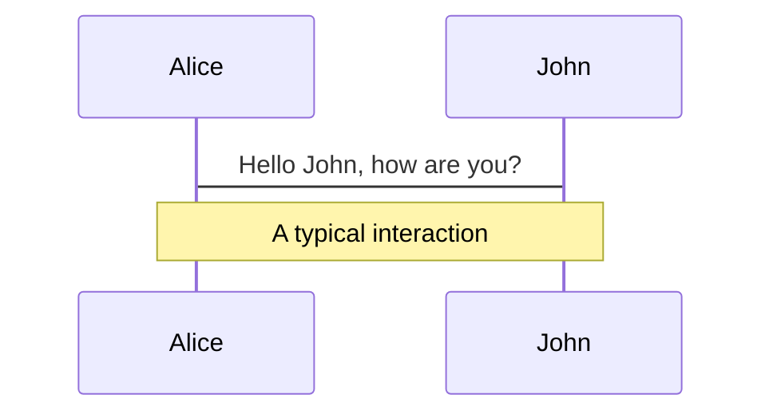

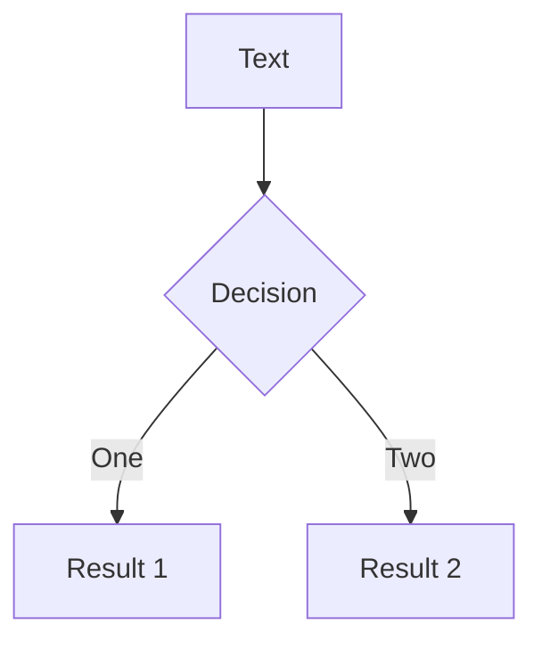

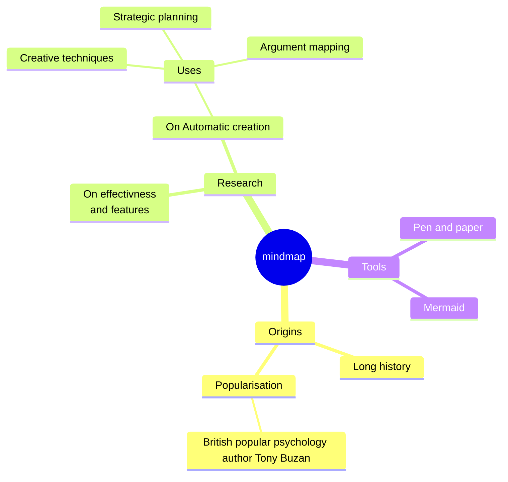

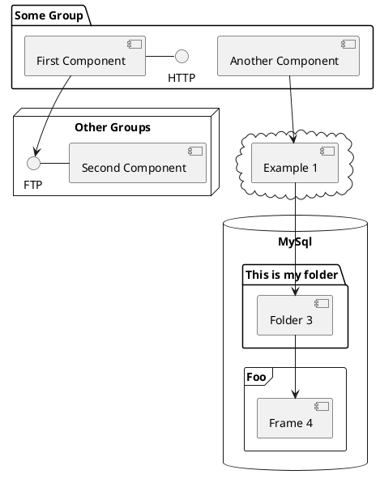

</div>

[Learn More](https://sli.dev/guide/syntax.html#diagrams)

---
src: ./pages/multiple-entries.md
hide: false
---

---
layout: center
class: text-center
---

# Learn More

[Documentations](https://sli.dev) · [GitHub](https://github.com/slidevjs/slidev) · [Showcases](https://sli.dev/showcases.html)
